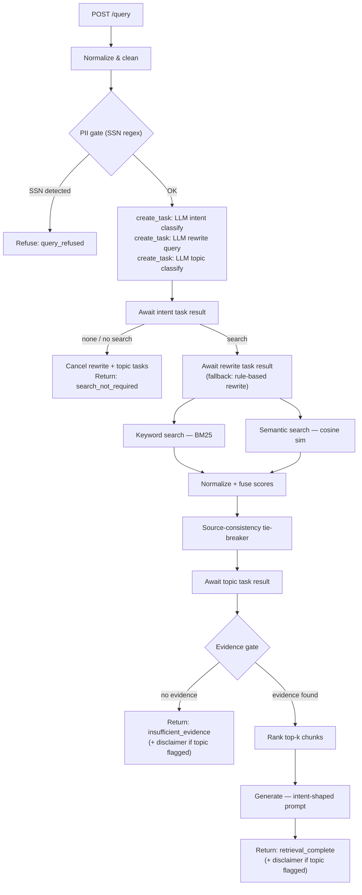

# StackAI RAG Assessment

A FastAPI backend implementing a Retrieval-Augmented Generation pipeline over PDF knowledge bases. Text is extracted from uploaded PDFs, split into overlapping chunks, embedded with Mistral, and stored locally. Queries are intent-gated, rewritten, retrieved via hybrid BM25 + semantic search, fused, and answered by a grounded LLM with per-claim citations.

No external RAG library or vector database is used.

---

## System Architecture



---

## Design Rationale

### Chunking

All pages are concatenated into a single document string, with each page's character range recorded as a span. The paragraph-accumulation chunker then runs over the full document: it accumulates paragraphs into a buffer up to `chunk_size_chars` (1,200 characters), emits a chunk, and starts the next one with the last `chunk_overlap_chars` (180 characters, roughly 1–2 sentences) of the previous chunk. Long single paragraphs are force-split at the nearest sentence boundary. When a chunk is emitted, its character range is compared against the recorded page spans to assign `page_start` / `page_end` — most chunks map to a single page, chunks that naturally straddle a page boundary get an accurate two-page citation (e.g. `page_start=4, page_end=5`).

**Why paragraph-aware rather than fixed-width sliding windows?** Fixed-width windows break sentences mid-thought, which degrades both BM25 term matching (a key term may land at the edge of two windows) and embedding quality (the model encodes an incomplete semantic unit). Paragraph boundaries are natural topic breaks, so keeping them together improves coherence.

**Why document-level rather than page-scoped?** The old per-page approach truncated chunks at page boundaries even when a sentence or paragraph ran across the boundary, producing an artificially cut-off chunk from the bottom of one page and an orphaned fragment at the top of the next. Running over the full document lets the chunker respect paragraph boundaries wherever they actually fall; the page attribution is still precise because it is computed from recorded character offsets, not assumed from the chunking boundary.

**Trade-off:** Very short pages (captions, headers-only) may produce chunks below `min_chunk_chars` (250 characters) and are skipped. This means caption-only figures are not retrievable; a future improvement would be image OCR for figure captions.

**OCR fallback:** If `pypdf` extracts no text (scanned PDFs), the file is uploaded to Mistral OCR (`mistral-ocr-latest`), which returns Markdown per page. The same chunker runs on the Markdown output. The uploaded file is always deleted from Mistral's servers after processing.

---

### Hybrid Retrieval and Score Fusion

Both keyword and semantic retrievers run independently over the full chunk corpus and return scored candidate sets that may be disjoint — each retriever surfaces whatever it considers relevant, and the two result sets are merged rather than intersected.

**Keyword search** is a from-scratch BM25 implementation (no external library), using the standard Robertson–Sparck Jones weighting with smoothed IDF (`k1=1.5`, `b=0.75` — the conventional Okapi BM25 defaults). Scoring requires three corpus-wide statistics: per-term document frequency, per-chunk length, and average chunk length. None of these depend on the query, so the index (tokenized chunks, term frequencies, document frequencies, average length) is built once and cached in memory, and only rebuilt when the corpus changes via ingestion or reset.

**Semantic search** embeds the query with `mistral-embed` and computes cosine similarity against stored chunk embeddings, which are persisted in a JSONL file and loaded into memory at query time. Only embeddings missing from the cache are generated on demand, so repeated queries over a stable corpus incur no redundant embedding API calls.

**Why linear fusion over normalized scores, rather than Reciprocal Rank Fusion (RRF)?** RRF combines two ranked lists by position alone — a chunk's contribution depends only on *where* it ranks in each list (`1 / (k + rank)`), not by how much better it scored than its neighbors. That discards information we wanted to keep: a chunk that BM25 scores dramatically higher than the runner-up is a stronger signal than one that barely edges it out, and RRF can't distinguish the two. Linear fusion over normalized scores preserves that margin.

**Known limitation — single-retriever chunks are not penalised for absent corroboration.** Both retrievers truncate their candidate lists to `semantic_candidate_k` before fusion. A chunk that ranked 21st in BM25 but 1st in semantic appears keyword-only in the merged set, and the fusion code treats absent scores as "pass through unweighted" rather than zero: a keyword-only chunk at normalised score 1.0 fuses to 1.0, while a chunk corroborated by both retrievers with scores 1.0 and 0.4 fuses to `0.3 × 1.0 + 0.7 × 0.4 = 0.58`. Corroboration is penalised rather than rewarded. The correct fix is to defer truncation until after fusion so every chunk carries both scores before the weights are applied. This interacts with the keyword-only degraded mode (uniform weights would need renormalising when semantic search is disabled or unavailable) and shifts the score distribution the evidence thresholds were calibrated against, so it belongs with a scorecard re-run rather than as a drop-in change.

**Score normalization:** raw BM25 scores and cosine similarities live on different, unrelated scales, so each retriever's result set is min-max normalized to `[0, 1]` before fusion — otherwise the fusion weights wouldn't mean what they're supposed to mean. This is a simple, interpretable normalization, but it is sensitive to outliers: a single unusually high BM25 score (e.g. a chunk that happens to repeat a rare query term many times) compresses every other score toward the low end. A percentile-based or z-score normalization would be more robust to that but adds complexity that didn't seem justified for this corpus size.

**Fusion weights: 30% keyword, 70% semantic.** Swept `α` (keyword weight) from 0.0 to 1.0 against `qa_scorecard.py`. Results were flat from `α=0.0` to `α=0.7` — the two retrievers overlap on ~28% of top candidates per query, so the split only matters at the margins. Past `α=0.8`, heavy keyword weighting cost a query that needed semantic matching. The current 0.3/0.7 split sits inside that flat region rather than at a uniquely optimal point — the sweep confirms it isn't worse than any alternative tried, not that it's the single best value.

**Source-consistency tie-breaker:** for short queries (≤ 4 terms), the fused ranking can surface chunks from multiple documents at similar scores even when the query clearly targets one document. When one source holds at least 60% of the top-8 window, a small additive bonus (`+0.05`) is applied to that source's chunks within the window. This is deliberately small and narrowly scoped — a nudge, not a re-ranking override — because a more aggressive version risks reinforcing an accidentally dominant document (e.g. one with simply more or longer chunks) rather than correcting a genuinely ambiguous query. It's disabled entirely for longer, multi-concept queries where single-source intent is less plausible.

**Evidence gating:** before chunks are returned, two independent thresholds must both pass:

- `relevance_threshold` (0.3) — the minimum fused score, catching generally weak matches.
- `min_query_term_coverage` (0.5) — at least half the query's meaningful tokens must literally appear in the chunk text.

These catch different failure modes. Fused score alone can miss a specific weakness of semantic search: an embedding can rate two texts as highly similar in *meaning* while sharing almost no actual vocabulary, which the score threshold won't necessarily catch if both retrievers agree on a moderately high score for a topically-adjacent-but-wrong chunk. The coverage check is a cheap, literal sanity check layered on top of a different failure mode than the score threshold covers. If no chunk clears both, the response status is `insufficient_evidence` and no answer is generated.

---

### Intent Gating and Policy Filters

The pipeline uses two different strategies depending on the nature of the check.

**PII detection is rule-based (SSN regex only).** The check runs before any retrieval and triggers an immediate refusal. Using a rule here is the *more correct* choice, not just the cheaper one: sending potentially-sensitive query text to a third-party API in order to classify it as PII would defeat the purpose of the check. The pattern is tight (`\d{3}[-\s]\d{2}[-\s]\d{4}`) — it requires the canonical hyphen/space separators, so bare nine-digit strings are not caught.

As soon as the PII gate passes, three `asyncio.create_task` calls fire concurrently:

**1. Intent classification** (`"search"` / `"none"`, `max_tokens=5`, `temperature=0`) — awaited before the retrieval decision. Handles phrasings that rule-based prefix matching misclassifies, e.g. `"what's up with the housing market"`. Exact `CHITCHAT_QUERIES` matches ("hello", "hi") short-circuit before the LLM is consulted. Falls back to rule-based `QueryProcessor` result if the call fails; `diagnostics.intent` records which path was taken (`llm_retrieval_intent`, `llm_no_retrieval_intent`, or the rule-based values). If intent is `"none"`, the rewrite and topic tasks are cancelled immediately.

**2. Query rewrite** (`max_tokens=80`, `temperature=0`) — awaited after intent clears. The model strips conversational filler and rephrases the query as a concise, keyword-rich search string while preserving technical terms and acronyms. Falls back to the rule-based rewrite (filler-prefix stripping + corpus acronym expansion) if the call fails.

**3. Legal/medical topic classification** (`"legal"` / `"medical"` / `"none"`, `max_tokens=5`, `temperature=0`) — awaited after retrieval completes, so it adds zero wall-clock latency on the critical path. Rule-based patterns for this check had recall near zero — queries like "what are the side effects of ibuprofen?" don't contain the specific trigger phrases a regex would need, so the disclaimer was never attached when it should have been. Failed calls are treated as `"none"` and no disclaimer is attached.

**Cost:** three `mistral-small-latest` calls per retrieval-bound query. Queries that short-circuit at the intent gate pay only the intent call (rewrite and topic tasks are cancelled). The PII gate itself is free — SSN check is a local regex.

**Answer-intent shaping remains rule-based** (`list` / `compare` / `summarize` / `factual`) — the trigger patterns are unambiguous regex anchors on the first word(s) of the query, so LLM overhead is not justified.

---

## API Endpoints

| Method | Path | Description |
|--------|------|-------------|
| `GET` | `/health` | Liveness check |
| `POST` | `/ingestion/pdfs` | Ingest one or more PDF files |
| `GET` | `/ingestion/documents` | List all ingested documents |
| `DELETE` | `/ingestion/reset` | Clear all ingested data and embeddings |
| `POST` | `/query` | Query the knowledge base |
| `POST` | `/embeddings/warmup` | Pre-generate embeddings for all chunks |
| `GET` | `/ui` | Browser UI |

### POST /ingestion/pdfs

Accepts `multipart/form-data` with one or more `files`.

- PDFs only; validated by file extension
- Max file size enforced (`max_upload_size_mb`, default 25 MB)
- SHA-256 deduplication: re-uploading an identical file is a no-op
- Text extracted with `pypdf`; falls back to Mistral OCR for image-only PDFs
- Chunks persisted to `data/records/chunks.jsonl`
- Documents persisted to `data/records/documents.jsonl`

### POST /query

Request body:

```json
{ "query": "string", "top_k": 5 }
```

Response fields of note:

| Field | Description |
|-------|-------------|
| `status` | `search_not_required` / `query_refused` / `retrieval_complete` / `insufficient_evidence` |
| `diagnostics.intent` | `llm_retrieval_intent` / `llm_no_retrieval_intent` (LLM path) or `retrieval_request` / `topic_query` / `no_retrieval_intent` (rule-based fallback) |
| `diagnostics.policy_flag` | `pii_detected` (rule-based, pre-retrieval) / `legal_topic` / `medical_topic` (LLM, post-retrieval) / `null` |
| `diagnostics.answer_intent` | `factual` / `list` / `compare` / `summarize` |
| `retrieved_chunks` | Ranked chunks with `relevance_score`, `keyword_score`, `semantic_score` |
| `generated_answer` | LLM answer with inline citations (when generation is enabled) |
| `cited_chunk_ids` | Chunk IDs referenced in the generated answer |
| `disclaimer` | Legal or medical disclaimer when `policy_flag` is set |
| `hallucination_warning` | `true` if any sentence in the answer shares no vocabulary with the retrieved chunks |
| `unsupported_sentences` | List of specific sentences that triggered `hallucination_warning` |

---

## Retrieval Pipeline (Step by Step)

1. **Normalize and clean** — collapse whitespace, strip punctuation artifacts.
2. **PII gate** — check for SSN pattern (`\d{3}[-\s]\d{2}[-\s]\d{4}`). Match triggers immediate refusal (`query_refused`); no retrieval occurs.
3. **Fire async LLM tasks** — `asyncio.create_task` dispatches three concurrent LLM calls: intent classification (`"search"` / `"none"`), query rewrite, and sensitive topic classification (`"legal"` / `"medical"` / `"none"`). All three run in parallel.
4. **Await intent result** — if `"none"`, cancel rewrite and topic tasks and return `search_not_required`. Falls back to rule-based classification if the LLM call failed.
5. **Await rewrite result** — use LLM-rewritten query as the retrieval query; falls back to rule-based rewrite (filler strip + acronym expansion) if the call failed.
6. **Keyword retrieval** — BM25 search over all query variants (original and topic-extracted form).
7. **Semantic retrieval** — embed the query with `mistral-embed`, compute cosine similarity against stored chunk embeddings. Missing embeddings are generated and cached.
8. **Score fusion** — min-max normalize both score sets; compute weighted sum (30% keyword, 70% semantic).
9. **Source-consistency bonus** — apply small tie-breaker for short queries over a consistent top window.
10. **Await topic classifier** — collect the LLM result; resolve disclaimer string if `legal_topic` or `medical_topic`.
11. **Evidence gate** — filter by relevance threshold and query-term coverage; return `insufficient_evidence` (with disclaimer if set) if nothing passes.
12. **Answer generation** — call `mistral-small-latest` with an intent-shaped prompt. If the model returns a hedge phrase (e.g. "I don't have enough evidence in the provided documents to answer that."), that response is surfaced directly to the user as `generated_answer` without requiring citations. For factual answers, citations are extracted from the response or inferred from token overlap with the retrieved chunks; if neither succeeds, the answer is still surfaced as `generated_answer` rather than discarded, flagged with `hallucination_warning: true` and an empty `cited_chunk_ids` so the caller knows it isn't traceable to a specific source.
13. **Hallucination check** — for cited answers, split the answer into sentences and flag any sentence that shares no vocabulary with the retrieved chunks (overlap threshold: 15%). Uncited answers (previous step) are flagged wholesale via `hallucination_warning` without running this per-sentence check, so `unsupported_sentences` stays empty in that case even though the warning is set.

---

## Query Refusal Policies

| Trigger | When | Behaviour |
|---------|------|-----------|
| SSN pattern (`\d{3}[-\s]\d{2}[-\s]\d{4}`) | Before retrieval (rule-based) | Refuse: `status=query_refused`, no retrieval |
| LLM classifies query as `legal` | After retrieval (async LLM) | Allow retrieval, attach legal disclaimer to response |
| LLM classifies query as `medical` | After retrieval (async LLM) | Allow retrieval, attach medical disclaimer to response |

The `policy_flag` field in `diagnostics` records which check fired (`pii_detected`, `legal_topic`, `medical_topic`, or `null`).

---

## Answer Shaping by Intent

The query processor classifies each retrieval-bound query into an answer intent, which selects a different system prompt for the LLM:

| `answer_intent` | Trigger pattern | Prompt behaviour |
|-----------------|-----------------|-----------------|
| `list` | "list all…", "enumerate…", "what are all the…" | Numbered list; each item must cite its source chunk |
| `compare` | "compare…", "difference between…", "versus" | Structured comparison; labelled paragraphs per subject |
| `summarize` | "summarize…", "summary of…", "overview of…" | Short paragraphs or outline with headers |
| `factual` | Everything else | Default inline-citation prose |

The `answer_intent` value is included in the response diagnostics.

---

## Hallucination Detection

After a successful generation, each sentence in the answer is checked against the retrieved chunks. A sentence is flagged as unsupported if the overlap between its meaningful tokens and the tokens of every retrieved chunk falls below 15%.

Short sentences (fewer than 5 meaningful tokens), hedge phrases ("I don't have enough evidence…"), and citation-only fragments are skipped. When the entire LLM response is a hedge phrase it is returned as `generated_answer` directly and the hallucination check is bypassed — the model is accurately reflecting the limits of its context, not hallucinating. When an answer has real content but no citation can be extracted or inferred, it's flagged with `hallucination_warning: true` directly, without running the per-sentence check — `unsupported_sentences` will be empty in that case, since the whole answer is being flagged for lacking a traceable source rather than for any specific sentence failing the overlap test. The per-sentence check itself is post-hoc and non-blocking for cited answers — the answer is still returned, but `hallucination_warning: true` and the specific `unsupported_sentences` are surfaced in the response so the caller can decide how to handle them.

**Why 15% and not stricter?** A higher threshold risks false positives when the LLM paraphrases with synonyms not in the chunks. 15% is a reasonable estimate, not a value swept against the scorecard.
---

## Storage and Persistence

All state is stored as newline-delimited JSON files under `data/`:

| File | Contents |
|------|----------|
| `data/records/documents.jsonl` | One document record per ingested PDF |
| `data/records/chunks.jsonl` | One chunk record per text slice |
| `data/records/chunk_embeddings.jsonl` | `{chunk_id: [float, …]}` map, appended on demand |
| `data/uploads/` | Original uploaded PDF files |

---

## Embeddings

- Model: `mistral-embed` (configurable via `MISTRAL_EMBEDDING_MODEL`)
- Embeddings are generated lazily during queries and cached to disk
- `POST /embeddings/warmup` pre-generates all missing embeddings upfront (useful before a demo); the browser UI exposes this as a one-click **Warm Up Embeddings** button in the Ingestion panel
- Rate-limit resilience: request pacing + exponential backoff on 429s

---

## Known Limitations and Future Work

These are the main scalability and correctness boundaries of the current implementation.

**Flat-file storage** — Documents, chunks, and embeddings are stored as JSONL files. The chunk list is parsed once and cached in memory after the first query, then invalidated on ingest or reset — so repeated queries over a stable corpus pay no disk I/O for chunk loading. Embeddings are still read from disk on every query (see below). Beyond ~10,000–20,000 chunks the remaining per-query overhead becomes the bottleneck; a production system would use a relational store for documents/chunks and a dedicated vector store for embeddings.

**Brute-force cosine similarity** — Semantic search computes cosine similarity between the query vector and every stored embedding in memory. This is O(n) per query with no indexing. For large corpora, an Approximate Nearest Neighbour index (e.g., HNSW via FAISS or hnswlib) would reduce this to O(log n) at the cost of slight recall loss.

**BM25 index is per-process and in-memory** — The cached BM25 index is local to a single uvicorn worker process. Under multi-worker deployments each worker maintains an independent cache, and invalidation signals from one worker do not propagate to others. This is correct for single-worker development use; a shared cache layer (Redis) or rebuilding from disk on each startup would be needed for multi-worker production.

**Embedding store fully loaded on each query** — The entire `chunk_embeddings.jsonl` file is deserialised into a dict on each query call. For corpora with tens of thousands of chunks this becomes a noticeable overhead. A memory-mapped format or an in-process cache with a TTL would remove most of this cost.

**No pagination on ingestion** — `POST /ingestion/pdfs` processes all uploaded files in a single request. Very large batches should be split by the caller.

---

## Security

### What is validated on upload

- **Extension check** — only `.pdf` files are accepted, validated by filename suffix before any processing begins.
- **Size cap** — files exceeding `max_upload_size_mb` (default 25 MB) are rejected before the bytes are read into the pipeline.
- **Path traversal prevention** — the stored filename is derived via `Path(original_filename).name`, stripping any directory components a client might embed in the `Content-Disposition` header (e.g. `../../etc/passwd.pdf`).
- **SHA-256 deduplication** — re-uploading an identical file is a no-op; the hash is computed before any disk write.
- **pypdf parse as the real content gate** — the extension check is a fast first filter, not a security boundary. The real gate is `pypdf` attempting to parse the uploaded bytes; a file that isn't a valid PDF will fail extraction and be returned as a `failed` ingestion result rather than stored.

### PII detection is intentionally local

SSN pattern matching runs as a local regex before the query reaches any external API. Sending the raw query to a third-party service to *classify whether it contains PII* would expose that data in transit — the check would undermine itself. This is why PII detection is the one gate that stays rule-based even though the other gates moved to LLM classification.

### Honest gaps

- **No authentication** — all endpoints are unauthenticated. `DELETE /ingestion/reset` will wipe the entire corpus for any caller with network access to the server. In production this endpoint would require admin credentials at minimum.
- **No rate limiting** — the query endpoint makes up to three upstream LLM API calls per request; a burst of concurrent requests could exhaust the Mistral rate limit or run up unexpected API cost.
- **Extension-only MIME check** — a renamed non-PDF (e.g. a `.pdf`-suffixed HTML file) passes the extension filter. `pypdf` will reject it at parse time, but the bytes are read into memory first.

---

## Libraries Used

| Library | Purpose | Link |
|---------|---------|------|
| FastAPI | Web framework, request routing, OpenAPI docs | https://fastapi.tiangolo.com |
| uvicorn | ASGI server | https://www.uvicorn.org |
| Mistral AI Python SDK | Embeddings, chat completion, OCR | https://github.com/mistralai/client-python |
| pypdf | PDF text extraction | https://github.com/py-pdf/pypdf |
| pydantic-settings | Typed settings from environment / `.env` | https://docs.pydantic.dev/latest/concepts/pydantic_settings |
| python-multipart | Multipart form parsing for file uploads (FastAPI dependency) | https://github.com/Kludex/python-multipart |
| httpx | Async HTTP client (Mistral SDK dependency) | https://www.python-httpx.org |

No external RAG framework or vector database is used.

---

## Run Locally

```bash
# 1. Create environment
uv venv .venv
source .venv/bin/activate

# 2. Install dependencies
uv sync --active

# 3. Set API key
echo "MISTRAL_API_KEY=your_key_here" > .env

# 4. Start server
uv run --active uvicorn app.main:app --reload

# 5. Open UI
open http://127.0.0.1:8000/ui
```

### Configuration

Key settings in `.env` (all optional, defaults shown):

```env
MISTRAL_API_KEY=
MISTRAL_EMBEDDING_MODEL=mistral-embed
MISTRAL_CHAT_MODEL=mistral-small-latest
GENERATION_ENABLED=true
CHUNK_SIZE_CHARS=1200
CHUNK_OVERLAP_CHARS=180
QUERY_TOP_K=5
SEMANTIC_SEARCH_ENABLED=true
```

---

## Quick Test Commands

**Ingest PDFs:**

```bash
curl -X POST "http://127.0.0.1:8000/ingestion/pdfs" \
  -F "files=@/path/to/file1.pdf" \
  -F "files=@/path/to/file2.pdf"
```

**Warm embeddings:**

```bash
curl -X POST "http://127.0.0.1:8000/embeddings/warmup"
```

**Query examples:**

```bash
# Chitchat — no retrieval
curl -s -X POST "http://127.0.0.1:8000/query" \
  -H "Content-Type: application/json" \
  -d '{"query":"hello"}'

# Factual question
curl -s -X POST "http://127.0.0.1:8000/query" \
  -H "Content-Type: application/json" \
  -d '{"query":"What does the document say about transformer architectures?","top_k":5}'

# List intent — structured answer
curl -s -X POST "http://127.0.0.1:8000/query" \
  -H "Content-Type: application/json" \
  -d '{"query":"List all the key contributions described in the paper"}'

# PII refusal
curl -s -X POST "http://127.0.0.1:8000/query" \
  -H "Content-Type: application/json" \
  -d '{"query":"My SSN is 123-45-6789, what does the document say about taxes?"}'
```

**Reset:**

```bash
curl -X DELETE "http://127.0.0.1:8000/ingestion/reset"
```

---

## Key Files

| File | Purpose |
|------|---------|
| `app/main.py` | FastAPI app, endpoint handlers, retrieval orchestration |
| `app/retrieval/query_processor.py` | Intent classification, query rewriting, policy gating |
| `app/retrieval/keyword_search.py` | BM25 implementation with in-memory index cache |
| `app/retrieval/semantic_search.py` | Cosine similarity search over stored embeddings |
| `app/retrieval/embeddings.py` | Mistral embedding client with rate-limit handling |
| `app/retrieval/answer_generator.py` | Grounded answer generation with intent-shaped prompts |
| `app/ingestion/pdf_ingestor.py` | PDF text extraction and OCR fallback |
| `app/ingestion/chunker.py` | Document-level, paragraph-aware chunking with page-offset attribution |
| `app/storage/document_store.py` | JSONL persistence for documents and chunks |
| `app/storage/chunk_reader.py` | Chunk loading with in-memory cache; invalidated on ingest or reset |
| `app/storage/embedding_store.py` | JSONL persistence for chunk embeddings |
| `app/schemas.py` | Pydantic request/response models |
| `app/config.py` | Typed settings with environment variable overrides |
| `ui/index.html` / `ui/app.js` / `ui/styles.css` | Browser UI |