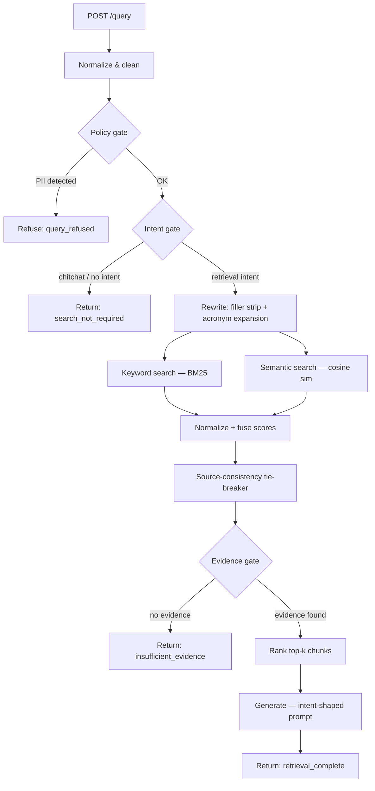

# StackAI RAG Assessment

A FastAPI backend implementing a Retrieval-Augmented Generation pipeline over PDF knowledge bases. Text is extracted from uploaded PDFs, split into overlapping chunks, embedded with Mistral, and stored locally. Queries are intent-gated, rewritten, retrieved via hybrid BM25 + semantic search, fused, and answered by a grounded LLM with per-claim citations.

No external RAG library or vector database is used.

---

## System Architecture



---

## Design Rationale

### Chunking

Text is chunked **per page**, never crossing page boundaries. Each page is split paragraph-by-paragraph, accumulating paragraphs into a buffer until the `chunk_size_chars` target (1,200 characters by default) would be exceeded. When that happens the current buffer is emitted as a chunk, and the next chunk starts with the last `chunk_overlap_chars` (180 characters, roughly 1–2 sentences) of the previous one. Long single paragraphs that exceed the target are force-split at the nearest sentence boundary.

**Why paragraph-aware rather than fixed-width sliding windows?** Fixed-width windows break sentences mid-thought, which degrades both BM25 term matching (a key term may land at the edge of two windows) and embedding quality (the model encodes an incomplete semantic unit). Paragraph boundaries are natural topic breaks, so keeping them together improves coherence.

**Why page-scoped?** Cross-page chunks conflate context from adjacent topics, which is common in academic PDFs where section headers fall near the bottom of one page. Page-scoping also makes citations precise: every chunk carries `page_start` / `page_end` metadata that maps directly back to the source document.

**Trade-off:** Very short pages (captions, headers-only) may produce chunks below `min_chunk_chars` (250 characters) and are discarded. This means caption-only figures are not retrievable; a future improvement would be image OCR for figure captions.

**OCR fallback:** If `pypdf` extracts no text (scanned PDFs), the file is uploaded to Mistral OCR (`mistral-ocr-latest`), which returns Markdown per page. The same chunker runs on the Markdown output. The uploaded file is always deleted from Mistral's servers after processing.

---

### Hybrid Retrieval and Score Fusion

Both keyword and semantic retrievers run independently over the full chunk corpus and return scored candidate sets that may be disjoint.

**BM25 keyword search** is implemented from scratch (no external library). It uses standard BM25+ IDF weighting with `k1=1.5`, `b=0.75`. The corpus index (tokenized chunks, per-doc term frequencies, document frequencies, average document length) is built once per corpus state and cached in memory; it is invalidated and rebuilt only when new documents are ingested or the corpus is reset.

**Semantic search** embeds the query with `mistral-embed` and computes cosine similarity against stored chunk embeddings. Embeddings are persisted in a JSONL file and loaded into memory at query time; only missing embeddings are generated during a query, so repeated queries over the same corpus incur no redundant embedding API calls.

**Why not Reciprocal Rank Fusion (RRF)?** RRF requires both retrievers to produce a ranked list over the same candidate pool. Here, each retriever searches independently and may surface different chunks. Linear fusion over normalized scores handles the union naturally: a chunk that appears in both ranked lists with high scores in each gets the full additive benefit; a chunk that only one retriever surfaces gets only that retriever's contribution.

**Score normalization:** Raw BM25 and cosine similarity scores have different ranges and distributions. Min-max normalization maps each retriever's result set to [0, 1] before fusion, making the weight parameter meaningful.

**Fusion weights:** 40% keyword, 60% semantic. Semantic search captures paraphrase and conceptual similarity; keyword search catches exact terminology and proper nouns that embedding models may not surface reliably. The 60/40 split favors semantic for general-purpose knowledge bases while preserving keyword precision for technical documents with domain-specific terms.

**Source-consistency tie-breaker:** For short queries (≤ 4 terms), the fused ranking sometimes surfaces chunks from multiple documents at similar scores even when the user's intent clearly targets one document. A small additive bonus (`+0.05`) is applied to all top-8 chunks from the dominant source, provided that source holds at least 60% of the top window and the query is short enough that single-source intent is plausible. This is intentionally conservative and disabled for longer, multi-concept queries.

**Evidence gating:** Before returning chunks to the caller, two thresholds are checked:
- `relevance_threshold` (0.3): minimum fused score; prevents very weak matches from appearing in results.
- `min_query_term_coverage` (0.5): at least half the query's meaningful tokens must appear in the chunk text; prevents semantically drifted embedding matches from passing as evidence.

If no chunk passes both thresholds, the response status is `insufficient_evidence` and no answer is generated.

---

## API Endpoints

| Method | Path | Description |
|--------|------|-------------|
| `GET` | `/health` | Liveness check |
| `POST` | `/ingestion/pdfs` | Ingest one or more PDF files |
| `GET` | `/ingestion/documents` | List all ingested documents |
| `DELETE` | `/ingestion/reset` | Clear all ingested data and embeddings |
| `POST` | `/query` | Query the knowledge base |
| `POST` | `/embeddings/warmup` | Pre-generate embeddings for all chunks |
| `GET` | `/ui` | Browser UI |

### POST /ingestion/pdfs

Accepts `multipart/form-data` with one or more `files`.

- PDFs only; validated by extension and MIME content
- Max file size enforced (`max_upload_size_mb`, default 25 MB)
- SHA-256 deduplication: re-uploading an identical file is a no-op
- Text extracted with `pypdf`; falls back to Mistral OCR for image-only PDFs
- Chunks persisted to `data/records/chunks.jsonl`
- Documents persisted to `data/records/documents.jsonl`

### POST /query

Request body:

```json
{ "query": "string", "top_k": 5 }
```

Response fields of note:

| Field | Description |
|-------|-------------|
| `status` | `search_not_required` / `query_refused` / `ready_for_retrieval` / `retrieval_complete` / `insufficient_evidence` |
| `diagnostics.intent` | `retrieval_request` / `topic_query` / `no_retrieval_intent` |
| `diagnostics.policy_flag` | `pii_detected` / `legal_topic` / `medical_topic` / `null` |
| `diagnostics.answer_intent` | `factual` / `list` / `compare` / `summarize` |
| `retrieved_chunks` | Ranked chunks with `relevance_score`, `keyword_score`, `semantic_score` |
| `generated_answer` | LLM answer with inline citations (when generation is enabled) |
| `cited_chunk_ids` | Chunk IDs referenced in the generated answer |
| `disclaimer` | Legal or medical disclaimer when `policy_flag` is set |
| `hallucination_warning` | `true` if any sentence in the answer shares no vocabulary with the retrieved chunks |
| `unsupported_sentences` | List of specific sentences that triggered `hallucination_warning` |

---

## Retrieval Pipeline (Step by Step)

1. **Normalize and clean** — collapse whitespace, strip punctuation artifacts.
2. **Policy gate** — check for PII patterns (SSN, payment card numbers) and sensitive topics (legal advice, medical advice). PII triggers an immediate refusal; legal/medical topics allow retrieval to proceed but attach a disclaimer to the response.
3. **Intent gate** — classify the query as `retrieval_request`, `topic_query`, or `no_retrieval_intent`. Chitchat and pure conversational input short-circuits here without hitting the retriever.
4. **Rewrite** — strip conversational filler prefixes ("can you tell me about…"), expand acronyms found in the corpus.
5. **Keyword retrieval** — BM25 search over all query variants (original and topic-extracted form).
6. **Semantic retrieval** — embed the query with `mistral-embed`, compute cosine similarity against stored chunk embeddings. Missing embeddings are generated and cached.
7. **Score fusion** — min-max normalize both score sets; compute weighted sum (40% keyword, 60% semantic).
8. **Source-consistency bonus** — apply small tie-breaker for short queries over a consistent top window.
9. **Evidence gate** — filter by relevance threshold and query-term coverage; return `insufficient_evidence` if nothing passes.
10. **Answer generation** — call `mistral-small-latest` with an intent-shaped prompt; validate that the response contains citations mapping to retrieved chunk IDs.
11. **Hallucination check** — split the answer into sentences; flag any sentence that shares no vocabulary with the retrieved chunks (overlap threshold: 15%).

---

## Query Refusal Policies

Refusals and disclaimers are applied before retrieval runs.

| Trigger | Behaviour |
|---------|-----------|
| SSN pattern (`\d{3}-\d{2}-\d{4}`) in query | Refuse: `status=query_refused`, no retrieval |
| 16-digit payment card number in query | Refuse: `status=query_refused`, no retrieval |
| Legal advice language ("can I sue", "am I liable", "legal advice", …) | Allow retrieval, attach legal disclaimer to response |
| Medical advice language ("diagnose", "symptoms of", "should I take", …) | Allow retrieval, attach medical disclaimer to response |

The `policy_flag` field in `diagnostics` records which rule fired.

---

## Answer Shaping by Intent

The query processor classifies each retrieval-bound query into an answer intent, which selects a different system prompt for the LLM:

| `answer_intent` | Trigger pattern | Prompt behaviour |
|-----------------|-----------------|-----------------|
| `list` | "list all…", "enumerate…", "what are all the…" | Numbered list; each item must cite its source chunk |
| `compare` | "compare…", "difference between…", "versus" | Structured comparison; labelled paragraphs per subject |
| `summarize` | "summarize…", "summary of…", "overview of…" | Short paragraphs or outline with headers |
| `factual` | Everything else | Default inline-citation prose |

The `answer_intent` value is included in the response diagnostics.

---

## Hallucination Detection

After a successful generation, each sentence in the answer is checked against the retrieved chunks. A sentence is flagged as unsupported if the overlap between its meaningful tokens and the tokens of every retrieved chunk falls below 15%.

Short sentences (fewer than 5 meaningful tokens), hedge phrases ("I don't have enough evidence…"), and citation-only fragments are skipped. The check is post-hoc and non-blocking — the answer is still returned, but `hallucination_warning: true` and the specific `unsupported_sentences` are surfaced in the response so the caller can decide how to handle them.

**Why 15% and not stricter?** A higher threshold produces false positives when the LLM paraphrases using synonyms not present verbatim in the chunks. The 15% floor targets only sentences that share *no* vocabulary with any chunk — genuine fabrication rather than valid reformulation.

---

## Storage and Persistence

All state is stored as newline-delimited JSON files under `data/`:

| File | Contents |
|------|----------|
| `data/records/documents.jsonl` | One document record per ingested PDF |
| `data/records/chunks.jsonl` | One chunk record per text slice |
| `data/records/chunk_embeddings.jsonl` | `{chunk_id: [float, …]}` map, appended on demand |
| `data/uploads/` | Original uploaded PDF files |

---

## Embeddings

- Model: `mistral-embed` (configurable via `MISTRAL_EMBEDDING_MODEL`)
- Embeddings are generated lazily during queries and cached to disk
- `POST /embeddings/warmup` pre-generates all missing embeddings upfront (useful before a demo)
- Rate-limit resilience: request pacing + exponential backoff on 429s

---

## Known Limitations and Future Work

These are the main scalability and correctness boundaries of the current implementation.

**Flat-file storage** — Documents, chunks, and embeddings are stored as JSONL files and read sequentially on every request. This works well up to ~10,000–20,000 chunks; beyond that, load time per query becomes the bottleneck. A production system would use a relational store for documents/chunks and a dedicated vector store for embeddings.

**Brute-force cosine similarity** — Semantic search computes cosine similarity between the query vector and every stored embedding in memory. This is O(n) per query with no indexing. For large corpora, an Approximate Nearest Neighbour index (e.g., HNSW via FAISS or hnswlib) would reduce this to O(log n) at the cost of slight recall loss.

**BM25 index is per-process and in-memory** — The cached BM25 index is local to a single uvicorn worker process. Under multi-worker deployments each worker maintains an independent cache, and invalidation signals from one worker do not propagate to others. This is correct for single-worker development use; a shared cache layer (Redis) or rebuilding from disk on each startup would be needed for multi-worker production.

**Embedding store fully loaded on each query** — The entire `chunk_embeddings.jsonl` file is deserialised into a dict on each query call. For corpora with tens of thousands of chunks this becomes a noticeable overhead. A memory-mapped format or an in-process cache with a TTL would remove most of this cost.

**No pagination on ingestion** — `POST /ingestion/pdfs` processes all uploaded files in a single request. Very large batches should be split by the caller.

---

## Libraries Used

| Library | Purpose | Link |
|---------|---------|------|
| FastAPI | Web framework, request routing, OpenAPI docs | https://fastapi.tiangolo.com |
| uvicorn | ASGI server | https://www.uvicorn.org |
| Mistral AI Python SDK | Embeddings, chat completion, OCR | https://github.com/mistralai/client-python |
| pypdf | PDF text extraction | https://github.com/py-pdf/pypdf |
| pydantic-settings | Typed settings from environment / `.env` | https://docs.pydantic.dev/latest/concepts/pydantic_settings |
| python-multipart | Multipart form parsing for file uploads (FastAPI dependency) | https://github.com/Kludex/python-multipart |
| httpx | Async HTTP client (Mistral SDK dependency) | https://www.python-httpx.org |

No external RAG framework or vector database is used.

---

## Run Locally

```bash
# 1. Create environment
uv venv .venv
source .venv/bin/activate

# 2. Install dependencies
uv sync --active

# 3. Set API key
echo "MISTRAL_API_KEY=your_key_here" > .env

# 4. Start server
uv run --active uvicorn app.main:app --reload

# 5. Open UI
open http://127.0.0.1:8000/ui
```

### Configuration

Key settings in `.env` (all optional, defaults shown):

```env
MISTRAL_API_KEY=
MISTRAL_EMBEDDING_MODEL=mistral-embed
MISTRAL_CHAT_MODEL=mistral-small-latest
GENERATION_ENABLED=true
CHUNK_SIZE_CHARS=1200
CHUNK_OVERLAP_CHARS=180
QUERY_TOP_K=5
SEMANTIC_SEARCH_ENABLED=true
```

---

## Quick Test Commands

**Ingest PDFs:**

```bash
curl -X POST "http://127.0.0.1:8000/ingestion/pdfs" \
  -F "files=@/path/to/file1.pdf" \
  -F "files=@/path/to/file2.pdf"
```

**Warm embeddings:**

```bash
curl -X POST "http://127.0.0.1:8000/embeddings/warmup"
```

**Query examples:**

```bash
# Chitchat — no retrieval
curl -s -X POST "http://127.0.0.1:8000/query" \
  -H "Content-Type: application/json" \
  -d '{"query":"hello"}'

# Factual question
curl -s -X POST "http://127.0.0.1:8000/query" \
  -H "Content-Type: application/json" \
  -d '{"query":"What does the document say about transformer architectures?","top_k":5}'

# List intent — structured answer
curl -s -X POST "http://127.0.0.1:8000/query" \
  -H "Content-Type: application/json" \
  -d '{"query":"List all the key contributions described in the paper"}'

# PII refusal
curl -s -X POST "http://127.0.0.1:8000/query" \
  -H "Content-Type: application/json" \
  -d '{"query":"My SSN is 123-45-6789, what does the document say about taxes?"}'
```

**Reset:**

```bash
curl -X DELETE "http://127.0.0.1:8000/ingestion/reset"
```

---

## Key Files

| File | Purpose |
|------|---------|
| `app/main.py` | FastAPI app, endpoint handlers, retrieval orchestration |
| `app/retrieval/query_processor.py` | Intent classification, query rewriting, policy gating |
| `app/retrieval/keyword_search.py` | BM25 implementation with in-memory index cache |
| `app/retrieval/semantic_search.py` | Cosine similarity search over stored embeddings |
| `app/retrieval/embeddings.py` | Mistral embedding client with rate-limit handling |
| `app/retrieval/answer_generator.py` | Grounded answer generation with intent-shaped prompts |
| `app/ingestion/pdf_ingestor.py` | PDF text extraction and OCR fallback |
| `app/ingestion/chunker.py` | Paragraph-aware, page-scoped chunking |
| `app/storage/document_store.py` | JSONL persistence for documents and chunks |
| `app/storage/embedding_store.py` | JSONL persistence for chunk embeddings |
| `app/schemas.py` | Pydantic request/response models |
| `app/config.py` | Typed settings with environment variable overrides |
| `ui/index.html` / `ui/app.js` / `ui/styles.css` | Browser UI |
